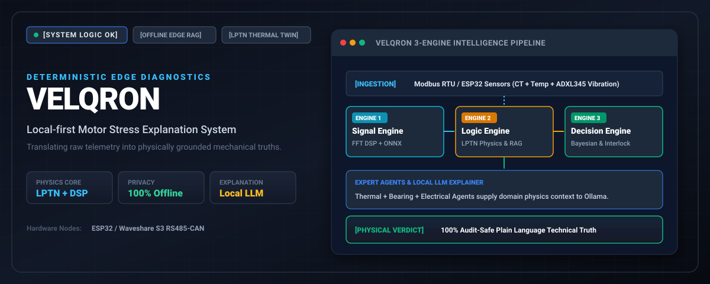
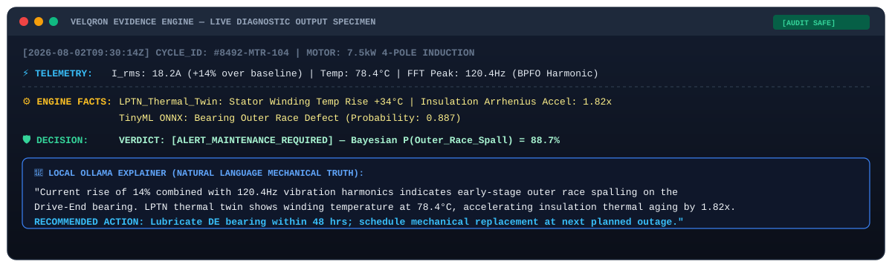
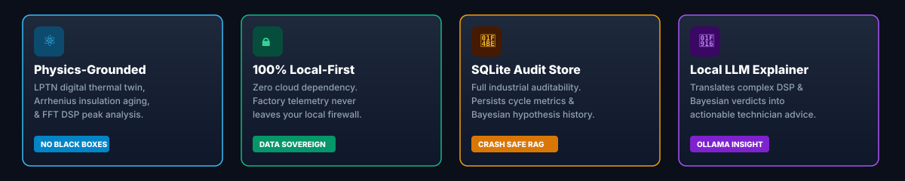
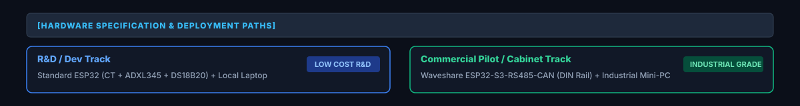

<!-- HERO BANNER -->
<p align="center">
  
</p>

<p align="center">
  <a href="https://github.com/rack0911/velqron/actions/workflows/ci.yml"></a>
  <a href="https://python.org"></a>
  <a href="LICENSE"></a>
  <a href="docs/user_guides/HARDWARE_GUIDE.md"></a>
  <a href="https://ollama.ai"></a>
</p>

---

## Overview

**Velqron** is an open-source **Industrial Predictive Intelligence** platform for electric motor health monitoring. 

Legacy systems rely on simple "alarm when hot" thermal limits or stream sensitive telemetry into third-party cloud platforms. Velqron deploys a **deterministic 3-Engine Integrated Pipeline** directly at the edge. By combining DSP signal processing, physics-grounded Lumped Parameter Thermal Networks (LPTN), and local LLMs (Ollama), Velqron translates raw vibration and current signals into plain-language, audit-safe mechanical explanations.

---

## Live Diagnostic Specimen

<p align="center">
  
</p>

---

## Core Architectural Pillars

<p align="center">
  
</p>

| Pillar | Principle | Physical Guarantee |
| :--- | :--- | :--- |
| **Physics-Grounded Twins** | LPTN Thermal Equations | Models rotor & stator thermal lag without waiting for external shell heat-up. |
| **Edge-Deterministic Verdicts** | Zero Cloud Latency | Contactor safety overrides and fault verdicts execute 100% locally. |
| **Auditable Evidence Store** | SQLite Context Ledger | Every flagged fault stores high-frequency waveform slices and Bayesian facts. |
| **Zero-Hallucination RAG** | Strict Pydantic Contracts | Prompts are bounded by NEMA MG1 nameplate specs and verified sensor deltas. |

---

## Hardware Deployment Tracks

<p align="center">
  
</p>

Velqron supports two distinct deployment hardware paths using a **single, unified codebase**:

| Mode | Edge Hardware Node | Gateway Compute | Target Use Case |
| :--- | :--- | :--- | :--- |
| **R&D / Dev Track** | Standard ESP32 (CT + ADXL345 + DS18B20) | Local Developer Workstation | Rapid testing, DSP validation, math tuning |
| **Commercial Track** | [Waveshare ESP32-S3-RS485-CAN](https://www.waveshare.com/wiki/ESP32-S3-RS485-CAN) (DIN Rail) | Industrial Mini-PC / Edge Server | Cabinet deployment, RS485 multi-node, pilot fleets |

---

## 3-Engine Intelligence Core

The diagnosis pipeline processes data across three decoupled, deterministic engines:

```
[Edge Telemetry (10Hz)] ──> [Signal Engine] ──> [Logic Controller] ──> [Decision Engine] ──> [Dual Explainer]
                                  │                     │                       │                     │
                             DSP Filters         Cycle Memory            Fault Rules             Local Ollama
                             (FFT / RMS)         (Baselines)             (Bayesian P)            (Structured JSON)
```

1. **Signal Engine (`src/engines/signal_controller.py`):** Ingests raw serial/Modbus streams, calculates RMS currents, detects zero-crossing intervals, and computes Fast Fourier Transform (FFT) harmonics.
2. **Logic Controller (`src/engines/logic_controller.py`):** Maintains cycle state machine (`STARTING`, `RUNNING`, `COOLDOWN`), tracks baseline drift using dual Exponential Moving Averages (EMA), and runs the LPTN thermal digital twin.
3. **Decision Engine (`src/engines/decision_engine.py`):** Evaluates multi-variate rules, correlates spectral peaks with bearing ball-pass frequencies, and computes Bayesian fault probabilities.

---

## Quick Start

### Prerequisites
* Python 3.10+
* [Ollama](https://ollama.ai) installed locally (for local AI reasoning)

### 1. Clone & Setup Environment
```bash
git clone https://github.com/rack0911/velqron.git
cd velqron
python -m venv venv
source venv/bin/activate  # On Windows: venv\Scripts\activate
pip install -r requirements.txt
```

### 2. Configure Local Environment
```bash
cp .env.example .env
```

### 3. Pull Local LLM Model
```bash
ollama pull qwen2.5:3b
```

### 4. Launch Operator Dashboard
```bash
chmod +x run.sh
./run.sh
```
The Streamlit dashboard will open at `http://localhost:8501`.

---

## Documentation Hub

Comprehensive technical specifications are available in the [docs/](docs/) directory:

* [System Architecture](VELQRON_SYSTEM_ARCHITECTURE.md) — Comprehensive technical architecture & data pipeline specs.
* [Database Schema](docs/design/DATABASE_SCHEMA.md) — SQLite Evidence Store schema & audit record design.
* [Hardware Guide](docs/user_guides/HARDWARE_GUIDE.md) — Circuit diagrams, BOM, and ESP32 wiring instructions.
* [Installation Guide](docs/user_guides/INSTALL.md) — Step-by-step industrial deployment guide.

---

## Author & Contact

Designed and built by **Rizwin** ([@rack0911](https://github.com/rack0911)).

If you are an industrial reliability engineer, factory operator, or fellow builder interested in edge diagnostics, offline AI, or pilot deployments:

* **Email:** [rizwin@fleqtor.com](mailto:rizwin@fleqtor.com)
* **GitHub Issues:** [github.com/rack0911/velqron/issues](https://github.com/rack0911/velqron/issues)
* **X (Twitter):** [@rizwin_a](https://x.com/rizwin_a)

---

## License & Contributing

Velqron is released under the **Apache 2.0 License**. 

Contributions, bug reports, and hardware integration feedback are welcome! Please check out [CONTRIBUTING.md](CONTRIBUTING.md) or open an issue to get started.

---
<p align="center">
  <sub>README styled with <a href="https://github.com/oil-oil/beautify-github-readme">beautify-github-readme</a></sub>
</p>
