# Velqron — Technical System Architecture


---

## Table of Contents
1. [Executive Overview](#executive-overview)
2. [System Topology](#1-system-topology)
3. [Project Structure](#2-project-structure)
4. [Data Ingestion & Preprocessing](#3-layer-a-data-ingestion--preprocessing)
5. [3-Engine Intelligence Core](#4-layer-b-the-3-engine-intelligence-core)
6. [Expert Agent Ensemble](#5-layer-c-expert-agent-ensemble)
7. [RAG Knowledge Integration](#6-layer-d-rag--knowledge-integration)
8. [Dual-Explainer Synthesis](#7-layer-e-dual-explainer-synthesis)
9. [Field Intelligence & Evidence](#8-field-intelligence--evidence)
10. [Event State Machine & Anti-Flip Logic](#9-event-state-machine--anti-flip-logic)
11. [Configuration & Calibration](#10-configuration--calibration)
12. [Dashboard & Visualization](#11-dashboard--visualization)
13. [Deployment Architecture](#12-deployment-architecture)

---

## Executive Overview

Velqron is an **Industrial Predictive Intelligence** platform for motor health monitoring. It moves beyond legacy "alarm when hot" threshold systems by deploying a deterministic **3-Engine Integrated Pipeline** at the edge.

**What makes it different:**
- **Cycle-Based Preprocessing** (CycleMetrics) — Unified Pydantic models for single-pass telemetry analysis.
- **Stress Acceleration Modeling** (Arrhenius thermal aging, LPTN thermal physics models) — not black-box ML
- **Bayesian hypothesis ranking** — probability-weighted root cause analysis, not static lookup tables
- **Cycle fingerprinting** — detects mechanical drift weeks before threshold alarms trigger
- **Evidence-based audit trail** (SQLite Store) — full diagnostic traceability for every event
- **Controller Dominance** — Logic engines provide the verdict; agents provide the physics context.
- **Zero cloud dependency** for core diagnostics — the LLM is an optional reasoning enhancer

---

## 1. System Topology (Hybrid Intelligence Split)

Velqron utilizes a tiered compute architecture to balance real-time safety, logic integrity, and large-model reasoning.

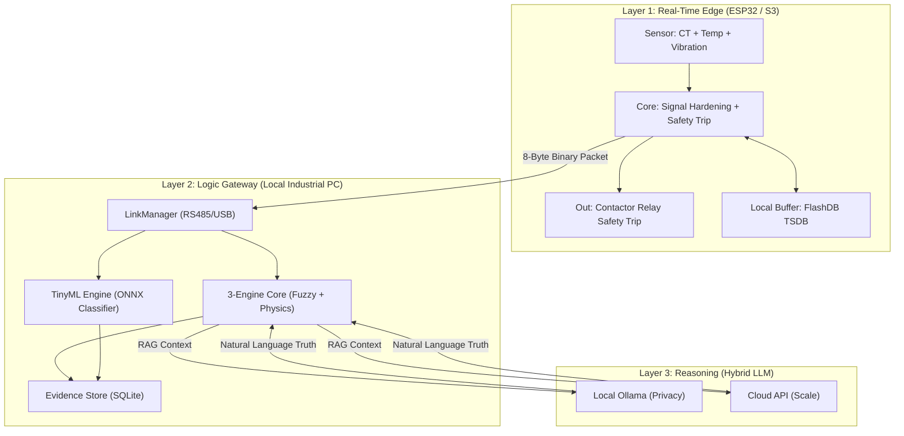

### Deployment Strategy (Uniform BOM)

To maintain maximum development velocity with a low cost-of-entry, Velqron follows a two-track hardware path using a single, unified codebase:

| Mode | Edge Hardware | Gateway Resource | Use Case |
| :--- | :--- | :--- | :--- |
| **Testing / Dev** | ₹599 Standard ESP32 | Local Laptop (Ollama) | R&D, Math Validation, Logic Hardening. |
| **Commercial** | **Waveshare S3-RS485-CAN** | Local Mini-PC OR Cloud | Industrial Pilot, Cabinet Deployment, Enterprise Fleet. |

**Primary Commercial Hardware:** [Waveshare ESP32-S3-RS485-CAN](https://www.waveshare.com/wiki/ESP32-S3-RS485-CAN)
- **Why this board?**: Full electrical and digital port isolation, built-in 24V supply support, and a DIN rail ABS enclosure matching cabinet deployment specs.
- **Uniformity:** The Python `LinkManager` and the C++ `Firmware Core` are 100% identical. The S3 simply unlocks high-fidelity waveform buffers and multi-node RS485 polling via runtime PSRAM detection.

---

## 2. Project Structure

```
motor-stress-intelligence/
├── firmware/
│   └── motor_ai/
│       ├── motor_ai.ino              # ESP32 C++ main coordinating script
│       ├── config.h                  # Hardware assignments & shared variable definitions
│       ├── adc_frontend.h            # Auto-bias offset & RMS statistical feature calculator
│       └── safety_interlock.h        # Leaky bucket safety trip controller
├── src/
│   ├── core/
│   │   ├── analyzer.py               # Pipeline router (cycle vs realtime)
│   │   ├── orchestrator.py           # Master pipeline orchestrator (multi-motor aware)
│   │   ├── config.py                 # Pydantic BaseSettings config
│   │   ├── knowledge.py              # RAG: Fault KB + motor spec retrieval
│   │   ├── motor_context.py          # State encapsulation for multi-motor support
│   │   └── profile_manager.py        # Motor profile loader (JSON)
├── engines/
│   ├── signal_controller.py      # Baseline, Trend, and State logic
│   ├── logic_controller.py       # Event, Persistence, and Fingerprint logic
│   ├── decision_engine.py        # Risk, Action, and Hypotheses (Merged)
│   ├── baseline_engine.py        # EMA & Dual-EMA baseline metrics calculation (drift, deviation, trend)
│   ├── anomaly_engine.py         # Isolation Forest unsupervised anomaly model (3-sigma triggers)
│   ├── tinyml_engine.py          # TinyML ONNX Classifier (16 vibration features)
│   ├── cycle_memory.py           # Cycle history SQL persistence
│   └── fallback_engine.py        # Deterministic LLM fallback

│   ├── agents/
│   │   ├── thermal_agent.py          # LPTN thermal twin model
│   │   ├── bearing_agent.py          # RMS ripple analysis
│   │   ├── insulation_agent.py       # Thermal-electrical correlation
│   │   ├── operator_checklist_agent.py # Manual shift checklist (wobble, leaks)
│   │   └── remediation_agent.py      # Context-aware fix recommendations
│   └── utils/
│       ├── dual_explainer.py         # Local + Cloud LLM orchestration
│       ├── llm_input_builder.py      # Structured prompt assembly
│       ├── sanitizer.py              # Signal cleaning & interpolation
│       ├── simulator_engine.py       # Synthetic fault scenario generator
│       ├── motor_profiles.py         # Multi-motor profile library
│       ├── serial_detector.py        # Auto-detect ESP32 serial port
│       └── logger.py                 # Structured logging
├── knowledge/
│   └── motors/standard_specs.json    # Motor specification knowledge base
├── data/
│   ├── motor_profile.json            # Active motor commissioning profile
│   └── velqron.db                    # SQLite Evidence Store
├── dashboard.py                      # Streamlit UI
├── reader.py                         # Hardware serial ingestion
└── main.py                           # CLI entry point
```

---

## 3. Layer A: Data Ingestion & Preprocessing

Raw sensor data from the industrial floor is inherently noisy due to EMF interference, serial packet drops, and sensor quantization errors. The preprocessing layer ensures clean, high-value metrics reach the engines.

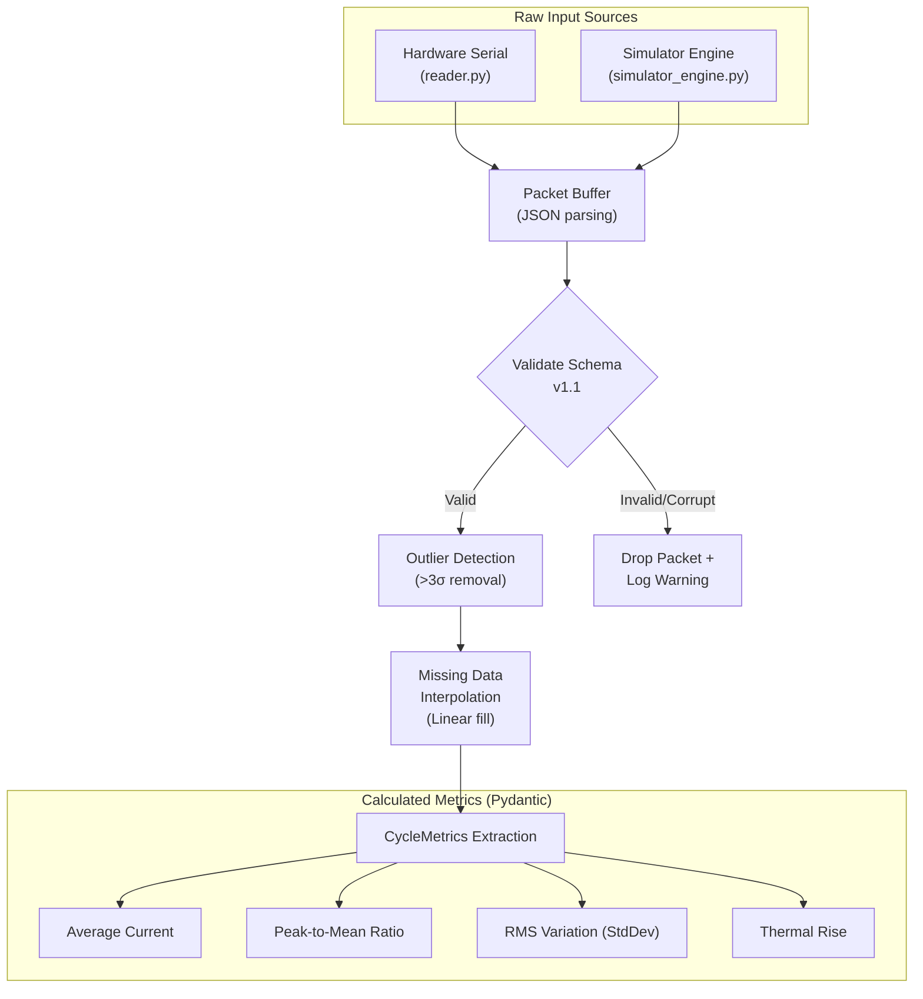

**Key Design Decisions:**
- **HMAC Command Security:** All calibration and safety reset commands are HMAC-SHA256 signed to prevent tampering.
- **Hardware-Adaptive Scaling:** Firmware automatically detects PSRAM (S3 Board) at runtime. If found, it unlocks **4x sampling resolution** (2000Hz) and high-fidelity waveform buffering for deep MCSA analysis.
- **Zero-Crossing Sync:** Sampling windows are phase-locked to AC zero-crossings for repeatable mechanical feature extraction.
- **Dynamic Noise Floor:** Automatically calibrates sensitivity to the local electrical environment during boot-up.

---

## 4. Layer B: The 3-Engine Intelligence Core

The diagnostic core is consolidated into 3 specialized deterministic engines. Each engine manages a logical domain, enabling multi-motor state isolation through the `MotorContext` object.

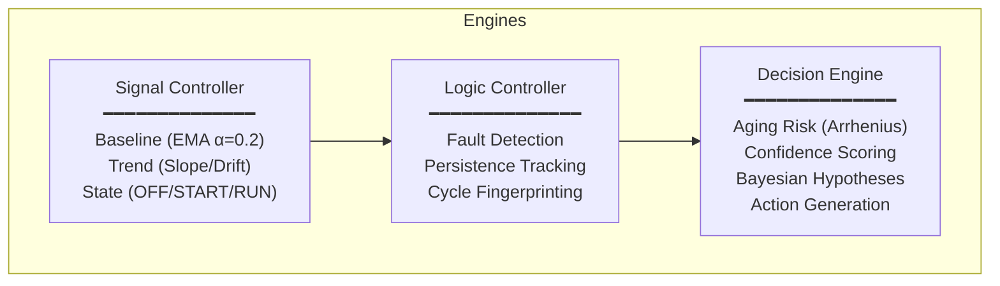

### Engine Data Flow (per cycle):

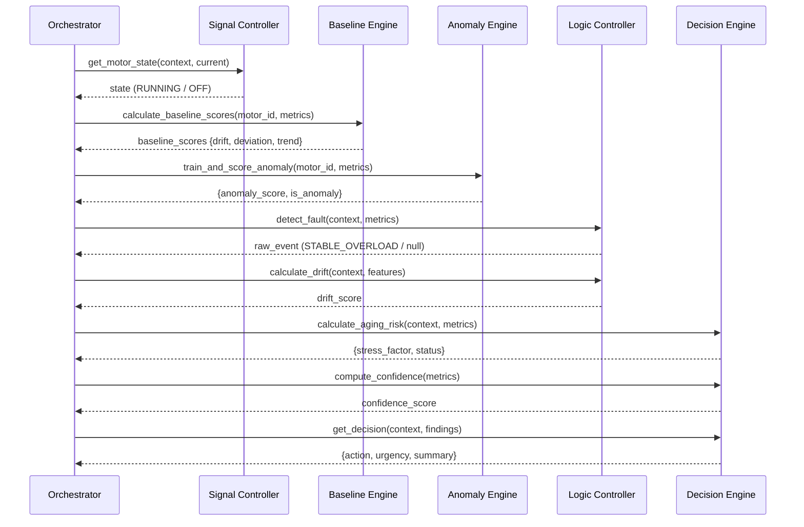

### Baseline, Anomaly & TinyML Engines

Velqron incorporates unsupervised statistical learning and edge-based deep signature diagnostics. The pipeline includes three auxiliary engines within the `src/engines/` directory to run alongside the deterministic controller:

1. **Baseline Engine (`baseline_engine.py`):**
   - **Running EMA & Dual-EMA Tracking:** Calculates rolling windows for primary motor indicators: average current, current variation/standard deviation, power factor, and temperature rise delta.
   - **Short vs Long Term Drift:** Compares slow-adapting baseline (slow $\alpha = 0.05$) against current parameters.
   - **Metrics Output:** Generates `drift_score`, `deviation_score`, and `trend_score` per operating cycle.

2. **Anomaly Engine (`anomaly_engine.py`):**
   - **Isolation Forest Model:** Trains an unsupervised `IsolationForest` estimator locally on historical healthy operating cycles (last 7 to 14 days of telemetry).
   - **3-Sigma Alert Trigger:** Evaluates active cycle metrics vectors (current, temperature, power factor) against the trained model. Mismatches that exceed a 3-sigma statistical distance are flagged, raising a high-priority `"ANOMALY_ALERT"` event requiring operator validation.

3. **TinyML Classification Engine (`tinyml_engine.py`):**
   - **Physics-Ground Feature-Based Classifier:** Instead of using heavy, non-explainable deep neural networks (CNNs), it uses a 16-feature Time & Frequency Domain Extractor feeding a Random Forest model compiled to ONNX format.
   - **Class Verdicts:** Predicts specific categories of bearing damage (`NORMAL`, `INNER_RACE`, `BALL_FAULT`, `OUTER_RACE`) with a validation accuracy of **99.82%** (trained on CWRU).
   - **ONNX Inference**: Runs on-device in under **1ms**, utilizing a lightweight `onnxruntime` wrapper with automatic fallback support.

---


## 5. Layer C: Expert Agent Ensemble

The agent ensemble follows a **"Priority-Based Expert Analysis"** pattern. Each agent is a domain specialist that provides physics-grounded context.

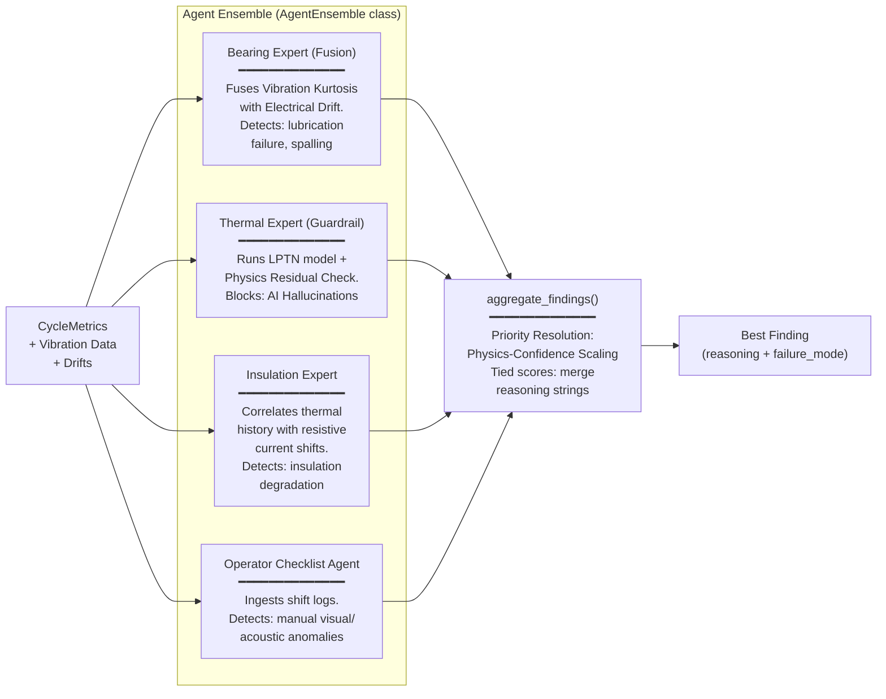

**Conflict Resolution:** When multiple agents disagree, the `aggregate_findings()` method selects the highest-severity finding and appends the secondary agent's reasoning. This ensures no diagnostic signal is lost while maintaining logic dominance.

---

## 6. Layer D: RAG & Knowledge Integration

Velqron implements **edge-local Retrieval-Augmented Generation (RAG)** — no vector database needed. The knowledge system has two tiers:

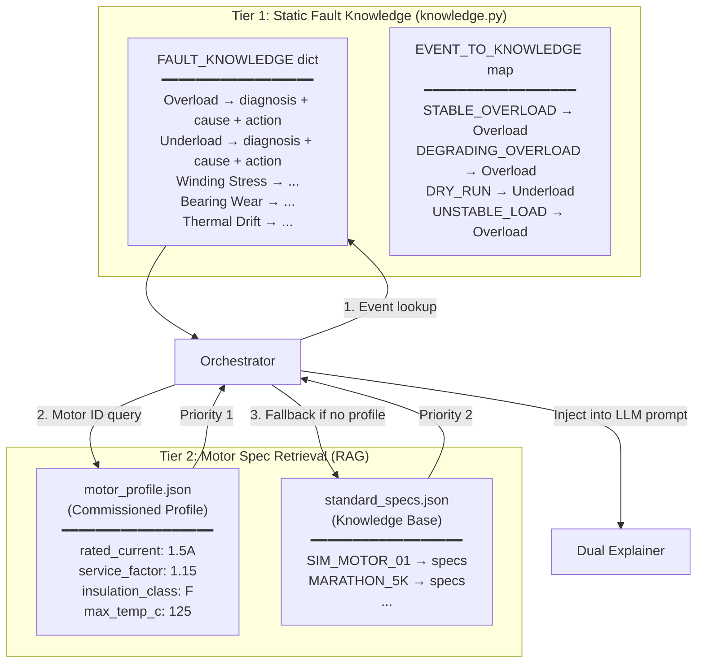

**Priority Chain:** Commissioned profile always overrides the generic knowledge base. This ensures site-specific nameplate data takes precedence over library defaults.

---

## 7. Layer E: Dual-Explainer Synthesis

The reasoning layer supports three LLM modes, with a CI/CD-safe mock mode for automated testing:

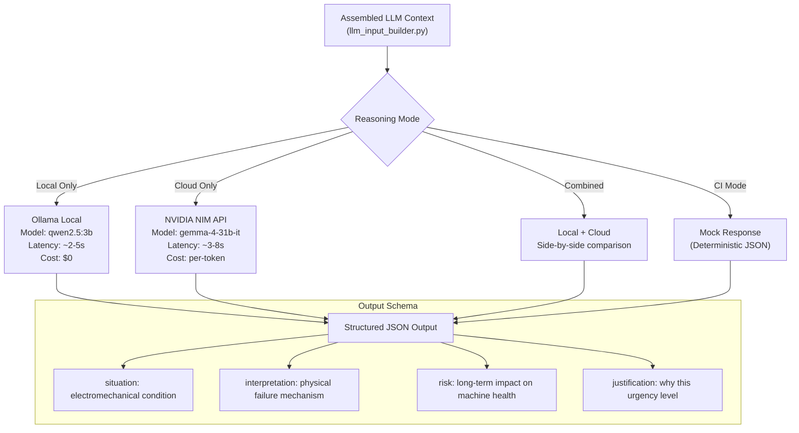

**Deterministic Fallback:** If both LLM providers fail, the system generates a structured diagnostic using template-based reasoning. The system never returns an empty or error state to the UI.

---

## 8. Field Intelligence & Evidence

Velqron functions as a trustworthy industrial audit system.

### I. Aging Risk Engine — Physics-Informed Stress Estimation

Velqron reports **Stress Acceleration** — how much faster the motor is aging today vs. its design baseline.

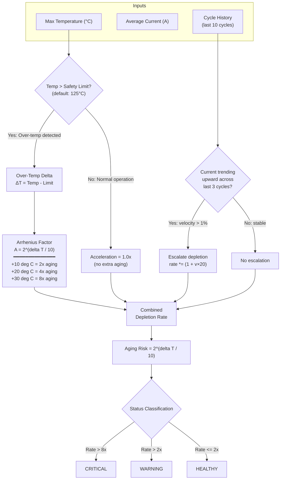

### II. Fingerprint Engine — Cycle Signature Analysis

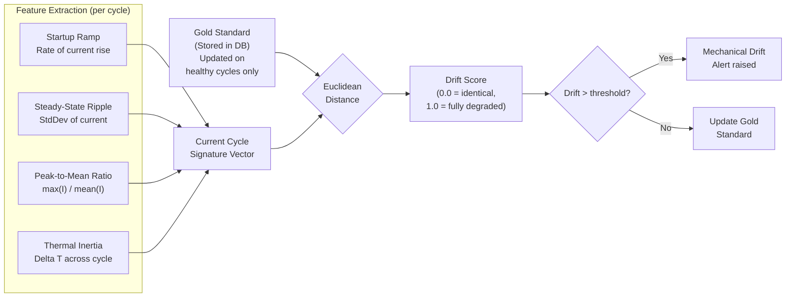

### III. Hypothesis Engine — Bayesian Evidence Network

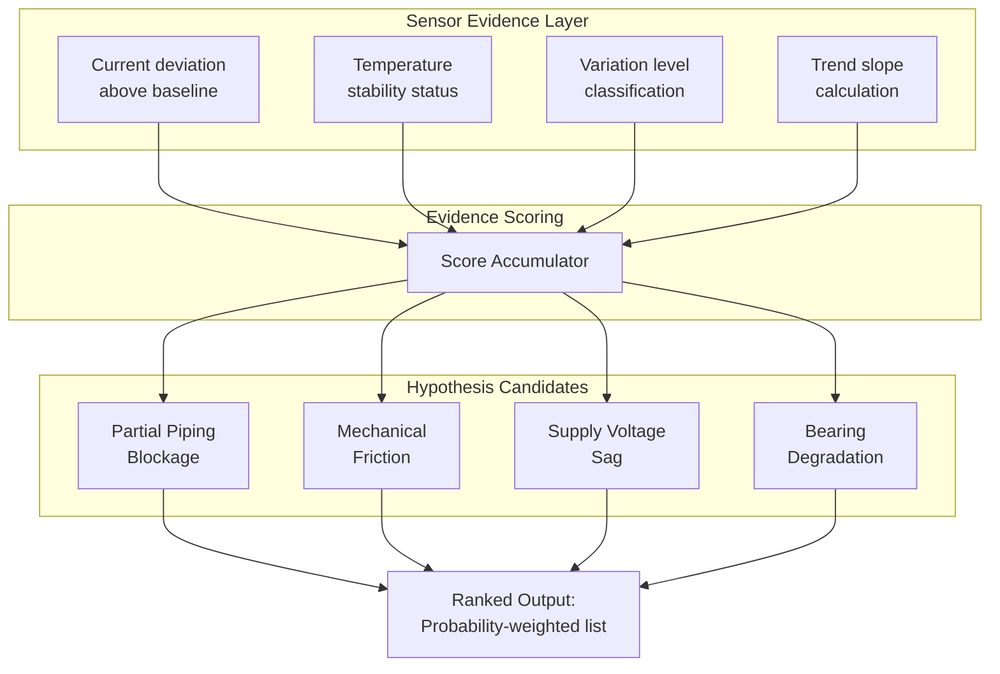

### IV. FlashDB Offline Buffer & Serial Sync Protocol (Edge Resilience)

To safeguard industrial predictive maintenance data against connection outages between the Edge Node (ESP32) and the Gateway PC, Velqron implements an **in-memory-to-flash serial synchronization engine** powered by **FlashDB**.

#### 1. Edge Storage Allocation (FAL & TSDB Partition)
Instead of standard filesystems which incur massive metadata write overhead, the ESP32 partition table allocates a dedicated raw partition named `fdb_tsdb1`. FlashDB TSDB interacts directly with the flash chips through the Flash Abstraction Layer (FAL) to achieve built-in **wear leveling** and **power-off protection**.

* **Partition Size:** 1MB (allocated dynamically at compile-time).
* **Record Allocation:** At 1Hz sampling, a single packed struct is 44 bytes. A 1MB partition stores ~22,700 metrics cycles (~6.3 hours of continuous disconnected telemetry logs).

#### 2. Packed Database Schema
Each time-series database record is serialized into a dense binary structure to minimize flash write size and bandwidth usage:

| Byte Offset | Data Type | Field | Scaling/Resolution |
|---|---|---|---|
| `[0-3]` | `uint32_t` | `timestamp` | Relative millisecond uptime (`millis()`) |
| `[4-7]` | `float` | `current` | RMS Current (A) |
| `[8-11]` | `float` | `temperature` | Stator Casing Temperature (°C) |
| `[12-15]` | `float` | `ambient_temp`| Ambient Temperature (°C) |
| `[16]` | `uint8_t` | `health` | Raw binary sensor health byte |
| `[17-20]` | `float` | `mean_dev` | Current Signal Mean Deviation |
| `[21-24]` | `float` | `peak` | Peak centered current (A) |
| `[25-28]` | `float` | `crest` | Signal Crest Factor |
| `[29-32]` | `float` | `v_rms` | Vibration RMS |
| `[33-36]` | `float` | `v_peak` | Vibration Peak |
| `[37-40]` | `float` | `v_kurt` | Vibration Kurtosis |
| `[41-44]` | `float` | `v_crest` | Vibration Crest Factor |
| `[45]` | `uint8_t` | `status` | Boolean status flags (Tripped, Overloaded) |

#### 3. State Synchronization Protocol

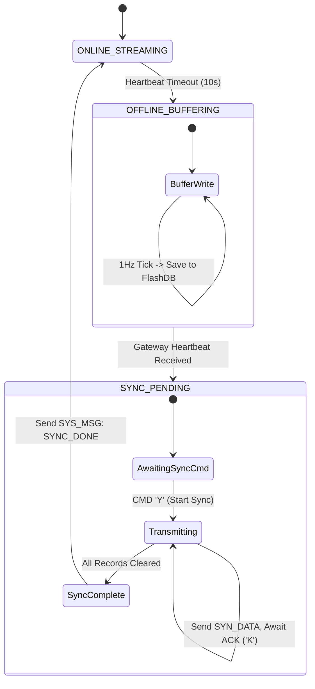

* **Outage Detection:** The Gateway PC sends a heartbeat byte (`H`) every 5 seconds. The ESP32 tracks the arrival. If `millis() - last_ping > 10000`, the ESP32 switches state to `OFFLINE_BUFFERING`.
* **Database Appends:** Ticks are saved to FlashDB using `write_telemetry_to_buffer()`.
* **Recovery and Flash Flush:**
  1. Upon receiving `H` again, the ESP32 halts live streaming, transitions to `SYNC_PENDING`, and writes `SYS_MSG: SYNC_PENDING` to the serial port.
  2. The Gateway PC (`reader.py`) intercepts this, pauses real-time calculations, and dispatches the sync start command `Y`.
  3. The ESP32 reads the oldest record from FlashDB and transmits it over serial:
     `SYN_DATA:timestamp,current,temp,amb_temp,health,mean_dev,peak,crest,v_rms,v_peak,v_kurt,v_crest,status`
  4. The Gateway parses this, computes the absolute timestamp (`PC_Time - (Current_Uptime - Record_Uptime)`), logs it to SQLite via `EvidenceStore.log_cycle()`, and sends back an acknowledgment byte (`K`).
  5. The ESP32 receives `K`, deletes the record from the TSDB index, and streams the next record.
  6. When the buffer is empty, the ESP32 sends `SYS_MSG: SYNC_DONE` and resumes normal 1Hz live streaming.

---

## 9. Event State Machine & Anti-Flip Logic

The state and persistence engines prevent false alarms. A fault must **persist across multiple cycles** before severity escalates.

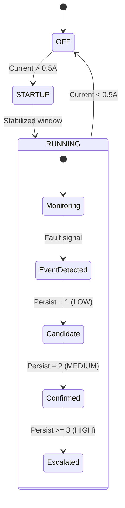

**Anti-Flip Rules:**
- Allow recovery to NORMAL from any state if the engine calls it.
- Block impossible transitions (e.g., DRY_RUN directly to OVERLOAD).
- Mode of last 3 events provides stabilization.

---

## 10. Configuration & Calibration

All system parameters are centralized in `src/core/config.py` using Pydantic `BaseSettings`:

| Parameter | Default | Purpose |
|-----------|---------|---------|
| `BASELINE_WINDOW` | 20 cycles | Rolling window for EMA baseline |
| `NOISE_FLOOR` | 0.15A | Below this = measurement noise |
| `OVERLOAD` threshold | +10% | Deviation above baseline |
| `DRY_RUN` threshold | -15% | Deviation below baseline |
| `MAX_TEMP_SAFETY` | 125°C | Conservative thermal limit |
| `INSULATION_CLASS` | F (155°C) | Absolute thermal ceiling |

### Modbus-First Calibration & Commissioning:
* **Digital Calibration:** Zero-bias offset calibration is offloaded to the digital PZEM-016 Modbus RTU hardware.
* **Commissioning Self-Test (Feature 4):** Direct verification loop scans the Modbus line nodes (PZEM-016 on ID 0x01, PT100 Converter on ID 0x02, and ADXL345 on I2C) to confirm wiring polarity and bus responsiveness prior to starting diagnostics.
* **Baseline Reset (Feature 5):** Re-calibrates system baseline calculations dynamically when a motor is serviced by clearing local SQLite metric tables and resetting the short/long-term EMA windows.

---

## 11. Dashboard & Visualization

The Streamlit dashboard provides both **Hardware Mode** and **Demo Mode** interfaces:

* **Real-Time Sensor Gauges**: Current (A), Temperature (°C), Motor State, and **Thermal Time-to-Trip Countdown (Feature 2)** showing time remaining under overload conditions before winding insulation degradation.
* **Intelligence Metrics**: Aging Risk (%), Drift Score (%), Confidence (%).
* **Operating Envelope**: 2D Plotly chart mapping Load vs Temp.
* **Diagnostic Panel**: Bayesian ranking, LLM reasoning, and remediation steps.
* **Configuration Audit Trail (Feature 1)**: Displaying chronological operator actions (recalibrations, limit overrides) retrieved from the SQLite `audit_log` store to prevent untraced updates.

---

## 12. Deployment Architecture

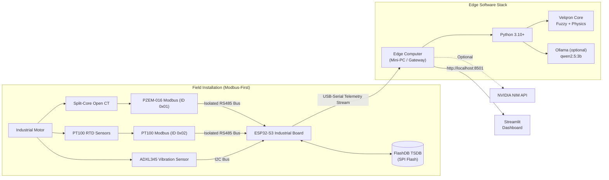

---

