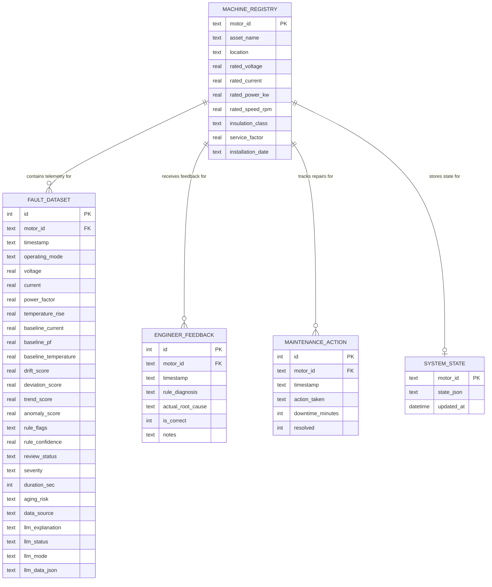

# Velqron Evidence Store — Database Schema Reference

> **Database:** SQLite · **File:** `data/velqron.db` · **Module:** `src/utils/database.py`

The Evidence Store is Velqron's audit-grade diagnostic persistence layer. As of Phase 13, it incorporates four primary schemas to record nameplate specifications, operating telemetry data, engineering baseline metrics, feedback verification loops, and maintenance actions.

---

## Entity-Relationship Diagram



---

## Core Table Definitions

### 1. `machine_registry` — Motor Nameplate & Location Specs

Stores the unique nameplate metadata and physical installation parameters for each monitored asset.

| Column | Type | Nullable | Description |
|---|---|---|---|
| `motor_id` | TEXT PK | No | Unique identifier for the motor (e.g. `SIM_MOTOR_01`) |
| `asset_name` | TEXT | No | Human-readable asset description |
| `location` | TEXT | Yes | Physical location in the factory |
| `rated_voltage` | REAL | Yes | Manufacturer rated voltage (V) |
| `rated_current` | REAL | Yes | Manufacturer rated current (A) |
| `rated_power_kw` | REAL | Yes | Rated mechanical power (kW) |
| `rated_speed_rpm` | REAL | Yes | Rated shaft speed (RPM) |
| `insulation_class` | TEXT | Yes | Class rating (e.g. `F`, `H`) |
| `service_factor` | REAL | Yes | Continuous overload capability factor |
| `installation_date` | TEXT | Yes | Date the asset was installed |

---

### 2. `fault_dataset` — Telemetry & Baseline Metrics

The main telemetry and analytical metric log representing the physical and virtual outputs for every operating cycle.

| Column | Type | Default | Description |
|---|---|---|---|
| `id` | INTEGER PK | - | Auto-incrementing identifier |
| `motor_id` | TEXT FK | - | References `machine_registry.motor_id` |
| `timestamp` | TEXT | - | ISO-8601 formatted cycle time |
| `operating_mode` | TEXT | - | Motor state: `STARTUP`, `RUNNING`, `SHUTDOWN`, `OFF` |
| `voltage` | REAL | - | Active cycle average voltage (V) |
| `current` | REAL | - | Active cycle average RMS current (A) |
| `power_factor` | REAL | - | Active cycle average power factor |
| `temperature_rise` | REAL | - | Thermal rise delta during the cycle (°C) |
| `baseline_current` | REAL | - | EMA-calculated base current baseline (A) |
| `baseline_pf` | REAL | - | EMA-calculated base power factor baseline |
| `baseline_temperature` | REAL | - | EMA-calculated base temperature baseline (°C) |
| `drift_score` | REAL | - | Cumulative trend drift output |
| `deviation_score` | REAL | - | Deviation offset relative to standard baseline |
| `trend_score` | REAL | - | Directional velocity slope calculation |
| `anomaly_score` | REAL | - | Isolation Forest anomaly output score |
| `rule_flags` | TEXT | - | Comma-separated rule codes (e.g., `OVERLOAD`, `DRY_RUN`) |
| `rule_confidence` | REAL | - | Logic voting ensemble confidence percentage |
| `review_status` | TEXT | `'NEW'` | Audit status: `NEW`, `ACKNOWLEDGED`, `INVESTIGATED`, `CLOSED` |
| `severity` | TEXT | - | Severity classification: `NONE`, `LOW`, `MEDIUM`, `HIGH`, `CRITICAL` |
| `duration_sec` | INTEGER | - | Cycle operating duration in seconds |
| `data_source` | TEXT | `'PHYSICAL'`| Telemetry source: `PHYSICAL` or `SIMULATED` |
| `llm_explanation` | TEXT | - | Natural language translation text |
| `llm_status` | TEXT | `'PENDING'`| AI processing state: `PENDING`, `SUCCESS`, `FAILED` |
| `llm_mode` | TEXT | - | Mode used: `LOCAL`, `CLOUD`, or `MOCK` |
| `llm_data_json` | TEXT | - | Grounding context sent to the LLM (raw JSON) |

---

### 3. `engineer_feedback` — Verification & Ground Truth

Captures maintenance engineer validation loops regarding the accuracy of diagnostic engine outputs.

| Column | Type | Nullable | Description |
|---|---|---|---|
| `id` | INTEGER PK | No | Auto-incrementing identifier |
| `motor_id` | TEXT FK | No | References `machine_registry.motor_id` |
| `timestamp` | TEXT | No | Verification timestamp |
| `rule_diagnosis` | TEXT | Yes | Velqron engine's raw event code classification |
| `actual_root_cause`| TEXT | Yes | Real fault description entered by the engineer |
| `is_correct` | INTEGER | Yes | Truth flag: `1` (True Alarm), `0` (False Alarm) |
| `notes` | TEXT | Yes | Supporting diagnostic details or inspections |

---

### 4. `maintenance_action` — Maintenance Logs & Outcomes

Records actual actions, time expenditures, and resolution success rates for tracking plant maintenance ROI.

| Column | Type | Nullable | Description |
|---|---|---|---|
| `id` | INTEGER PK | No | Auto-incrementing identifier |
| `motor_id` | TEXT FK | No | References `machine_registry.motor_id` |
| `timestamp` | TEXT | No | Action execution date |
| `action_taken` | TEXT | Yes | Description of repair task (e.g., `'Greased DE bearings'`) |
| `downtime_minutes` | INTEGER | Yes | Total machine downtime during resolution |
| `resolved` | INTEGER | Yes | Resolution status flag: `1` (Yes), `0` (No) |

---

## Compatibility & Auxiliary Tables

### `live_status` — Active Telemetry & Fault Snapshots

Stores the latest real-time telemetry snapshot and diagnosis metrics for the active dashboard interface.

| Column | Type | Key | Description |
|---|---|---|---|
| `motor_id` | TEXT | PK | Monitored motor identifier |
| `timestamp` | REAL | - | Latest update timestamp (unix epoch) |
| `current` | REAL | - | Active RMS current (A) |
| `temperature` | REAL | - | Stator temperature reading (°C) |
| `operating_mode` | TEXT | - | Active state (STARTUP, RUNNING, OFF) |
| `rule_flags` | TEXT | - | Active diagnostic codes (e.g. OVERLOAD, NORMAL) |
| `severity` | TEXT | - | Diagnosis severity level |
| `rule_confidence` | REAL | - | Combined logic confidence level |
| `explanation` | TEXT | - | Diagnostic explanation summary |
| `recommendation` | TEXT | - | Operator action suggestion |
| `urgency` | TEXT | - | Severity urgency (LOW, MEDIUM, URGENT) |
| `drift_score` | REAL | - | Calculated trend drift value |
| `deviation_score` | REAL | - | Current load deviation score |
| `trend_score` | REAL | - | Stator thermal rise velocity trend |
| `anomaly_score` | REAL | - | Isolation Forest anomaly probability |
| `voltage` | REAL | - | RMS Voltage (V) |
| `power_factor` | REAL | - | Load power factor |
| `time_to_trip` | REAL | - | Projected thermal countdown remaining in seconds (Feature 2) |

---

### `audit_log` — Configuration & Action Audit Trail

Holds a permanent chronological log of manual baseline modifications and calibration adjustments for configuration traceability (Feature 1).

| Column | Type | Key | Description |
|---|---|---|---|
| `id` | INTEGER | PK | Auto-incrementing identifier |
| `timestamp` | DATETIME | - | Audit execution timestamp |
| `operator` | TEXT | - | Operator or system tag triggering the action |
| `action` | TEXT | - | Action identifier code (e.g. BASELINE_RESET) |
| `details` | TEXT | - | Structured details of the changes made |

---

### `system_state` — Active State Persistence

Persists active fault counters, starting timestamps, and state tracking values. Survives power loss and reboots.

| Column | Type | Key | Description |
|---|---|---|---|
| `motor_id` | TEXT | PK | Motor identifier |
| `state_json` | TEXT | - | Compact state representation (active events, durations) |
| `updated_at` | DATETIME | - | Auto-updated synchronization timestamp |

---

### `calibration` — Calibration Log

| Column | Type | Description |
|---|---|---|
| `id` | INTEGER PK | Auto-incrementing identifier |
| `timestamp` | DATETIME | Calibration timestamp |
| `motor_id` | TEXT | Monitored motor |
| `zero_offset` | REAL | Zero offset correction |
| `noise_floor` | REAL | Noise floor threshold (A) |
| `rated_current` | REAL | Rated current calibrated (A) |
| `service_factor` | REAL | Service factor parameter |
| `certificate_path` | TEXT | Path to hardware calibration document |

---

## Raw Waveform Storage

High-frequency raw stator current waveforms are stored as **gzip-compressed CSV files** outside the database for performance:

```
~/.mcsa_data/raw_waves/
├── 1.csv.gz        # Cycle ID 1 waveform
├── 2.csv.gz        # Cycle ID 2 waveform
└── ...
```

**Why flat files?** Waveforms contain thousands of points per cycle. Compressed CSVs bypass database bloat, reduce file sizes by ~95%, and allow direct, fast loading for local synchronous scipy Fast Fourier Transform (FFT) analysis.

---

## Data Retention Policy

| Data Type | Retention | Mechanism |
|---|---|---|
| SQLite database logs | Indefinite | Retained for historical comparison and drift analysis |
| Raw waveform files | **30 days** | Auto-purged via `purge_old_raw_waveforms()` during cycles |
| System debug logs | 7 days | Rotated daily in the `src/utils/logger.py` module |

---

## Edge-Local Database: FlashDB Time-Series Schema

During offline buffering when the connection to the Gateway is interrupted, the ESP32 Edge Node records dynamic telemetry cycles to a **FlashDB** (or fallback wear-leveled **LittleFS**) local time-series store before syncing them back to the SQLite gateway database.

### TSDB Binary Schema (46 Bytes packed)

Every telemetry tick is recorded to the flash memory partition `fdb_tsdb1` as a dense packed binary structure:

| Offset (Bytes) | Field Name | Data Type | Units / Scale | Description |
|---|---|---|---|---|
| `[0-3]` | `timestamp` | `uint32_t` | `ms` | Relative uptime returned by `millis()` |
| `[4-7]` | `current` | `float` | `A` | Stator RMS Current |
| `[8-11]` | `temperature` | `float` | `°C` | Stator Casing Temperature |
| `[12-15]` | `ambient_temp` | `float` | `°C` | Ambient Temperature |
| `[16]` | `health` | `uint8_t` | - | Raw binary sensor health byte |
| `[17-20]` | `mean_dev` | `float` | - | Current signal mean deviation |
| `[21-24]` | `peak` | `float` | `A` | Peak centered current |
| `[25-28]` | `crest` | `float` | - | Signal Crest Factor |
| `[29-32]` | `v_rms` | `float` | - | Vibration RMS |
| `[33-36]` | `v_peak` | `float` | - | Vibration Peak |
| `[37-40]` | `v_kurt` | `float` | - | Vibration Kurtosis |
| `[41-44]` | `v_crest` | `float` | - | Vibration Crest Factor |
| `[45]` | `status` | `uint8_t` | - | Boolean status bitmask: Bit 7: `is_tripped`, Bit 6: `is_overloaded` |

---

*[← Back to Documentation Index](../INDEX.md)*
