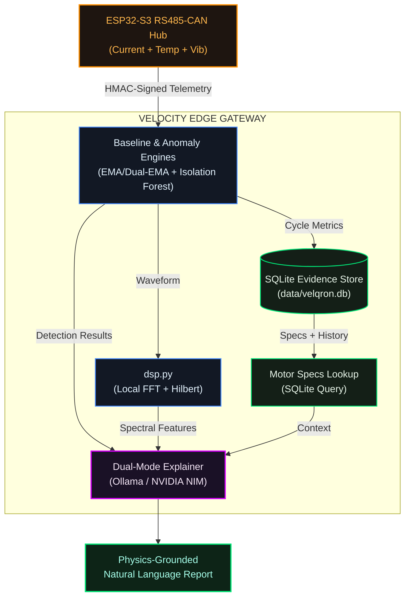

# Velqron Edge Architecture Deep Dive

> **Version:** v4.0 Ingestion & Storage  
> **Last Updated:** 2026-06-21

This document contrasts naive industrial AI approaches with Velqron's production-grade edge architecture, showing how **structured retrieval**, **local DSP processing**, and **industrial hardware hardening** solve real-world constraints of plant floor deployment.

---

## 1. Naive Cloud-Only Architecture (The Problem)

In generic IoT-AI pipelines, raw sensor data is forwarded directly to cloud LLMs without local processing or database grounding.

### Why It Fails

| Problem | Impact |
|---------|--------|
| **Token Explosion** | 20 seconds at 1kHz = 60,000+ tokens per cycle |
| **Latency** | 15+ seconds per inference (unusable for real-time) |
| **Cost** | Prohibitive API fees at scale |
| **Hallucination Risk** | No nameplate context = guessed thresholds |
| **Offline Failure** | Stops working without internet |

---

## 2. Velqron Edge Architecture (The Solution)

Velqron processes everything locally using deterministic physics and structured SQLite retrieval, reserving LLMs only for natural language explanation.

### Core Principles

1. **Physics First:** Deterministic detection using LPTN thermal models and signal processing
2. **Edge Complete:** 100% offline-capable with local SQLite evidence store
3. **LLM for Explanation Only:** Cloud/local LLMs receive dense context (<200 tokens), not raw data
4. **Structured Retrieval:** Motor specs and cycle history from SQLite, not vector search

### Architecture Flow



---

## 3. Industrial Hardware Hardening (The Isolated Core)

To move from bench prototype to factory pilot, Velqron targets the **Waveshare ESP32-S3-RS485-CAN** hardware hub.

### Hardware Target: [ESP32-S3-RS485-CAN](https://www.waveshare.com/wiki/ESP32-S3-RS485-CAN)

| Feature | Why It's Mandatory for MVP | Rationale vs. Consumer Boards |
|---------|---------------------------|-----------------------------|
| **Opto-Isolation** | Prevents Back-EMF destruction | Standard boards have direct GPIOs; inductive spikes from contactors would fry the CPU. The V1 hub isolates power and digital channels. |
| **24V DC Support** | Matches industrial rails | Standard dev boards require USB 5V converters; the RS485-CAN board mounts directly onto standard 24V industrial cabinet rails. |
| **Screw Terminals** | Vibration resistance | Breadboards or PH2.0 headers shake loose under mechanical vibration; screw terminals lock wires securely. |
| **8MB PSRAM & 16MB Flash** | High-Fidelity Waveforms | Memory expansion allows continuous high-fidelity sampling (2000Hz) and offline FlashDB time-series buffering. |
| **DIN-Rail ABS Casing** | Safe cabinet installation | Direct clips to standard industrial 35mm DIN-rails. |

### Rationale for Board Rejections

* **Waveshare Touch-LCD-5B / HMI Screens**: Rejected. Storing local dashboards inside sealed industrial cabinets is redundant, increases power consumption, creates a glass entry point for dust/moisture, and inflates BOM cost. All dashboard views are offloaded to the Gateway Streamlit page.
* **Standard Dev Kits (ESP32-DevKitC)**: Rejected. Lacks electrical isolation, screw terminals, and 24V cabinet supply regulators.
* **M5Stack Tough**: IP65 enclosure is great, but uses the older ESP32 chip (lacks vector AI acceleration instructions) and cannot mount natively on standard DIN rails.

---

## 4. Performance Optimization: CAG Prompt Caching

To minimize latency on edge CPUs, Velqron implements **Cache-Augmented Generation (CAG)**:

### Static Prefix (Cached, 85% of prompt)
- System instructions and JSON schema constraints
- Motor nameplate specifications (from SQLite)
- Commissioning baseline parameters
- **Result:** KV cache hits in <10ms

### Dynamic Suffix (15% of prompt)
- Current cycle telemetry metrics
- Active classification and trend data
- Spectral features from `dsp.py`

---

## 5. Vibration Diagnostics: Classical ML vs. Deep Learning (CNN)
 
For Phase 14C vibration classification of bearing faults, we contrasted two distinct on-edge machine learning paradigms:
1. **Classical ML (Feature-Based Random Forest + ONNX)** [CHOSEN]
2. **Deep Learning (1D-CNN on raw waveforms)**
 
### Paradigm Comparison
 
| Dimension | Classical ML (Random Forest) [CHOSEN] | Deep Learning (1D-CNN) |
|-----------|-------------------------------------|------------------------|
| **Accuracy** | **99.82%** (Verified on CWRU) | 99.9% |
| **Inference Latency** | **< 1ms** | 15ms - 50ms |
| **Model Size** | **389 KB** (ONNX format) | 5 MB - 20 MB |
| **Data Requirements** | Small dataset (works with <3000 samples) | Large dataset (>100,000 samples) |
| **Hardware Required** | Standard Edge CPU (Waveshare ESP32-S3) | Requires GPU / NPU acceleration |
| **Explainability** | High (Feature importances like RMS, Crest Factor, Std_Dev) | None (Black Box) |
 
### Why Classical ML was Chosen for the MVP
* **Ultra-low Memory Footprint**: The 389 KB ONNX model size fits easily inside the tight RAM/PSRAM constraints of the `ESP32-S3-RS485-CAN` industrial hub.
* **Physics Integration**: Instead of passing raw waveforms to a black box, we extract 16 time and frequency domain features (like RMS, Kurtosis, Crest Factor, and FFT peaks). This maintains grounding in classic mechanical physics.
* **Data Efficiency**: Classical ML trained to near-perfect accuracy (99.82%) with just 2,168 training samples, whereas deep CNNs require massive volumes of labeled data.
 
### Benefits of the TinyML Engine
1. **Fault Classification vs. Anomaly Detection**: Moves beyond generic warning signals to identify specific bearing defect categories (Inner Race, Ball, and Outer Race faults).
2. **Deterministic Preprocessing**: Features are extracted using deterministic numpy/scipy math, ensuring exact alignment between cloud training and edge execution.
 
### What Happens if it's Missing?
Without this TinyML layer, the gateway can only report **Generic Anomalies** (i.e. *"Vibration is abnormal"*). It cannot pinpoint the failure mode, preventing predictive maintenance teams from knowing whether a motor requires simple lubrication or an immediate bearing replacement.
 
---

## Architecture Comparison

| Dimension | Naive Cloud | Velqron v4.0 |
|-----------|-------------|--------------|
| **Edge Autonomy** | Cloud-dependent | [YES] 100% offline-capable |
| **Tokens per Cycle** | 60,000+ | [YES] <200 (99.7% reduction) |
| **Processing Latency** | 15+ seconds | [YES] <100ms deterministic + <1.5s explanation |
| **Data Privacy** | Raw data to cloud | [YES] Raw data stays local |
| **Detection Method** | LLM guessing | [YES] Physics-based deterministic |
| **Audit Trail** | None | [YES] Complete SQLite evidence store |
| **Multi-Motor Support** | Single instance | [YES] MotorContext isolation |

---

## Technical Implementation

### SQLite Evidence Store Schema

```sql
-- Machine Registry: Motor nameplate specifications
CREATE TABLE machine_registry (
    motor_id TEXT PRIMARY KEY,
    asset_name TEXT NOT NULL,
    location TEXT,
    rated_voltage REAL,
    rated_current REAL,
    rated_power_kw REAL,
    rated_speed_rpm REAL,
    insulation_class TEXT,
    service_factor REAL,
    installation_date TEXT
);

-- Fault Dataset: Telemetry & Baseline Metrics
CREATE TABLE fault_dataset (
    id INTEGER PRIMARY KEY AUTOINCREMENT,
    motor_id TEXT NOT NULL REFERENCES machine_registry(motor_id),
    timestamp TEXT NOT NULL,
    operating_mode TEXT NOT NULL,
    voltage REAL,
    current REAL,
    power_factor REAL,
    temperature_rise REAL,
    baseline_current REAL,
    baseline_pf REAL,
    baseline_temperature REAL,
    drift_score REAL,
    deviation_score REAL,
    trend_score REAL,
    anomaly_score REAL,
    rule_flags TEXT,
    rule_confidence REAL,
    review_status TEXT DEFAULT 'NEW',
    severity TEXT,
    duration_sec INTEGER,
    data_source TEXT DEFAULT 'PHYSICAL',
    llm_explanation TEXT,
    llm_status TEXT DEFAULT 'PENDING'
);

-- Engineer Feedback: Verification Loop
CREATE TABLE engineer_feedback (
    id INTEGER PRIMARY KEY AUTOINCREMENT,
    motor_id TEXT NOT NULL REFERENCES machine_registry(motor_id),
    timestamp TEXT NOT NULL,
    rule_diagnosis TEXT,
    actual_root_cause TEXT,
    is_correct INTEGER,
    notes TEXT
);

-- Maintenance Action: Repairs & Outcomes
CREATE TABLE maintenance_action (
    id INTEGER PRIMARY KEY AUTOINCREMENT,
    motor_id TEXT NOT NULL REFERENCES machine_registry(motor_id),
    timestamp TEXT NOT NULL,
    action_taken TEXT,
    downtime_minutes INTEGER,
    resolved INTEGER
);
```

---

## Core Scheduling Hardening & Validation

The transition from a naive loop prototype to a high-speed multitasking architecture (incorporating FreeRTOS core pinning and hardware timer interrupts) introduces subtle system-level risks. Below is our hardening strategy:

### 1. Dual-Core Allocation Optimization (Core 0 vs. Core 1)
* **Risk:** Core 0 handles the ESP32's background system processes (including Wi-Fi, Bluetooth, and internal flash operations). Pinning a tight 2000Hz sampling task to Core 0 can starve system threads, leading to task watchdog resets or network drops.
* **Hardening Strategy:** If testing reveals random reboots or telemetry drops during intensive network exchanges, we will swap task cores:
  * **Core 1:** Pinned to `SensorTask` (to isolate the high-speed ISR sampling).
  * **Core 0:** Pinned to `TelemetryTask` + standard ESP-IDF network and background idle loops.

### 2. Duty Profile Scaling (Continuous vs. Burst)
* **Risk:** Continuous 2000Hz sampling consumes significant CPU slices and blocks the I2C bus regularly via mutex locks, leaving little headroom for telemetry and calibration command writes.
* **Hardening Strategy:** For the MVP, we will support dual-mode sampling:
  * **Normal Mode (500Hz - 1000Hz):** Standard running rate, offering massive CPU headroom.
  * **Burst Mode (2000Hz for 10 seconds):** Triggered automatically when an anomaly score exceeds $3\sigma$, or when the gateway requests a high-resolution waveform sweep for MCSA analysis.

### 3. Stress Testing & Validation Gates
Before final pilot commissioning, the hardware timer implementation must pass the following stress testing criteria:
1. **ISR Latency Budget:** Validate that the hardware timer interrupt service routine (`onTimer`) completes within a sub-microsecond window, preserving the 500µs sampling slice.
2. **Watchdog Integrity:** Undergo a 24-hour test under heavy Wi-Fi and Modbus network load to verify the Task Watchdog (TWDT) does not panic.
3. **Watermark Stability:** Verify that `_max_occupancy` remains bounded and does not grow monotonically, proving the consumer pops samples fast enough.
4. **Overrun Recovery:** Force artificial buffer overruns (by blocking Core 1 execution for 2 seconds) and verify the system safely reports the overrun warning bit and recovers without deadlock.

---

## Gateway Language Rationale: Why Python?

Choosing the right language for the Gateway PC is a critical design trade-off. We selected **Python** over other options (.NET, Go, Rust, Node.js, C++) for the following reasons:

### 1. The Core Benefits of Python in Velqron
* **Scientific & DSP Ecosystem:** To compute Fast Fourier Transforms (FFTs) and envelope spectral features, we rely on **SciPy and NumPy**. These libraries are wrappers around highly optimized C/Fortran libraries, giving us near-native execution speeds with minimal code.
* **TinyML & AI Inference:** Python is the native platform for scikit-learn training and **ONNX Runtime** deployment, making bearing classification updates simple.
* **LLM & RAG Orchestration:** The reasoning layer uses Ollama for local LLM prompts. Python’s string manipulation, RAG utilities, and templating tools maximize development speed for grounding logic.
* **UI Prototyping Speed:** **Streamlit** allowed us to build a full, responsive operator dashboard in under 500 lines of code without a separate frontend build pipeline or API server.

### 2. Comparison with Alternative Stacks

| Stack | Why it was Rejected for the Gateway Layer |
| :--- | :--- |
| **C / C++** | While used on the ESP32 for raw speed, writing high-level string parsing, JSON handling, LLM prompt templates, and HTTP servers in C++ is slow, unsafe, and introduces severe memory leak risks on the Gateway PC. |
| **Rust** | Extremely fast and safe, but its DSP, SciPy-equivalent math libraries, and local machine learning runtime wrappers are far less mature and require excessive boilerplate. |
| **Go** | Excellent for web backends and concurrency, but lacks mature local data-visualization frameworks and standard pre-compiled scientific math libraries. |
| **.NET / C#** | C# has historical ties to Windows. Although .NET Core is cross-platform, running its heavy VM runtime on low-cost Linux Mini-PCs or single-board computers (Raspberry Pi) introduces significant memory overhead compared to a lightweight Python process. |
| **Node.js / JS** | JavaScript is single-threaded and struggles with heavy, synchronous mathematical computations (like high-frequency wave FFT parsing). Blocking the event loop would drop serial incoming ticks unless complex worker threads are managed. |

---

## Key Takeaways

1. **Physics beats ML for industrial trust** — Deterministic detection is auditable and explainable
2. **SQLite retrieval > Vector RAG** — Structured motor specs and cycle history are more reliable than semantic search
3. **Hardware Isolation is Mandatory** — Never connect raw MCU pins to industrial contactors; use Opto-Isolation.
4. **LLMs for explanation only** — Never use stochastic models for safety-critical detection

---

*For implementation details, see [DATABASE_SCHEMA.md](DATABASE_SCHEMA.md) and [DEVELOPMENT.md](../user_guides/DEVELOPMENT.md).*

