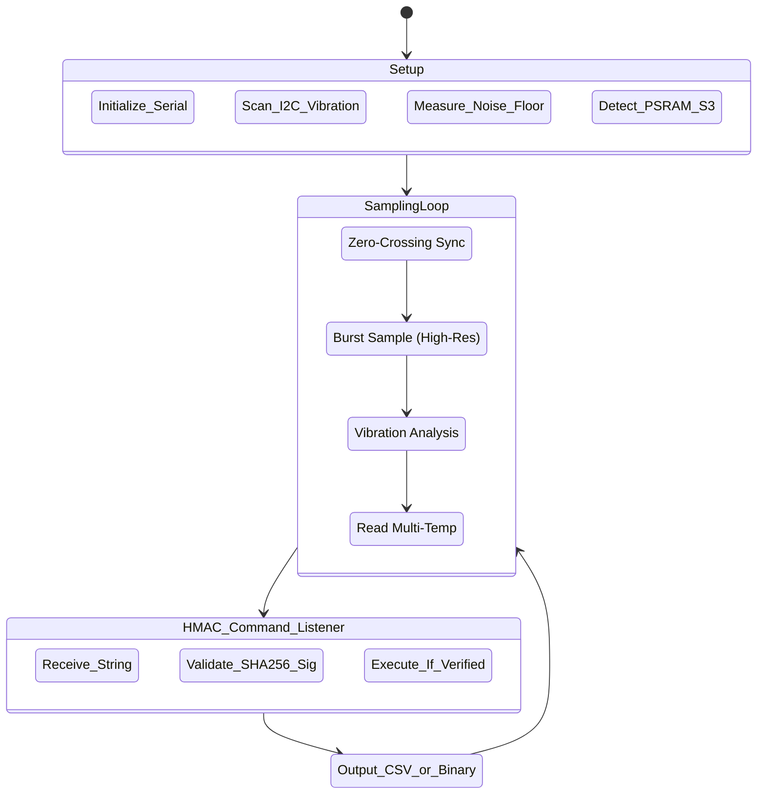

# Velqron ESP32 Firmware Reference

> **Language:** C++ (Arduino Framework) · **Hardware:** ESP32 · **Location:** `firmware/motor_ai/motor_ai.ino`

This document details the firmware running on the ESP32 edge node, which is responsible for high-frequency ADC sampling of the current and temperature sensors, and streaming that data to the Python analysis engine.

---

## Table of Contents

1. [Hardware Mapping](#hardware-mapping)
2. [Firmware Architecture](#firmware-architecture)
3. [Serial Protocol Specification](#serial-protocol-specification)
4. [Hardware-in-the-Loop (HIL) Mode](#hardware-in-the-loop-hil-mode)
5. [Fault Injection Commands](#fault-injection-commands)
6. [Compilation & Upload](#compilation--upload)

---

## Hardware Mapping

| Sensor | Pin (Default) | Function | Notes |
|---|---|---|---|
| **SCT-013-030 (CT)** | `GPIO 34` | RMS Current Sensing | 1.65V bias with **Zero-Crossing Sync** |
| **DS18B20 (Temp)** | `GPIO 4` | Stator & Ambient Temp | 1-Wire bus (supports multiple probes) |
| **ADXL345 (VIB)** | `I2C (SDA/SCL)` | Vibration Analysis | Triple-axis mechanical health |
| **Relay (Trip)** | `GPIO 23` | Safety Override | Drives Siemens SIRIUS contactor relay |
| **Status LED** | `GPIO 2` | System Status | Fast Blink = Calibration, Slow = OK |

---

## Firmware Architecture

The firmware utilizes **Hardware-Adaptive Scaling**. It automatically detects the **ESP32-S3 (PSRAM)** at runtime to unlock high-fidelity diagnostics.

### Key Hardening Logic
1. **Zero-Crossing Sync:** Sampling windows are phase-locked to the AC 0V transition, ensuring stable Crest Factor and Peak readings.
2. **Dynamic Noise Floor:** Automatically measures EMI noise levels at boot to prevent phantom readings in factory environments.
3. **PSRAM Wave-Buffer (S3 Only):** If 8MB PSRAM is detected, the sample count increases to **2,000Hz** and the full raw waveform is stored in memory.
4. **HMAC Secure Link:** Critical commands (Calibration, Trip Reset) are strictly rejected unless accompanied by a valid cryptographic signature.

---

### Telemetry Packet (TX)

Sent from the ESP32 to the gateway host.

**Format (Standard CSV):**
`current,temp,amb_temp,health,mean_dev,peak,crest,vib_rms,vib_peak,vib_kurt,vib_crest`

**Format (8-Byte Binary - Optional):**
`[Quantized Current][Quantized Temp][Health][Crest][Flags][Checksum]`

---

| Parameter | Type | Unit | Description |
|---|---|---|---|
| **current** | Float | Amperes | True RMS current |
| **temp** | Float | °C | Stator casing temperature |
| **health** | Int | Bitmask | Sensor status (3 = All OK, 2 = Current Fault, 1 = Temp Fault) |
| **uptime** | Int | Seconds | Seconds since ESP32 boot |

Example Output:
`1.450,45.2,3,3600`

### System Messages (TX)

Sent immediately over serial when specific hardware event triggers occur:

* `SYS_MSG: OVERLOAD_WARNING`: Sent on any tick where current exceeds `1.25x` rated current, incrementing the leaky bucket accumulator.
* `SYS_MSG: EMERGENCY_TRIP`: Sent if the accumulator reaches `3`, energizing the trip relay and cutting power to the contactor.
* `SYS_MSG: Emergency Trip Reset.`: Sent on manual override reset (`U` serial command).

---

## Hardware-in-the-Loop (HIL) Mode

During development without an actual physical motor running, you can connect the ESP32 and inject simulated fault profiles over the serial connection. The firmware intercepts these commands and mathematical alters the ADC readings before transmitting them back.

### Enabling HIL Mode

HIL mode is always active and listening on the Serial RX line.

---

## Fault Injection Commands

Send these single characters over the Serial Monitor (115200 baud) to trigger specific fault profiles:

| Command | State | Effect on Sensor Output |
|:---:|---|---|
| `N` | **Normal** | Adds baseline noise ($0.2A \pm 0.05$) to simulate healthy idling. |
| `O` | **Overload** | Adds constant scalar ($+0.8A$) to current; slowly increments temperature by $+0.5^\circ\text{C}$ per loop. |
| `U` | **Unstable Load** | Injects high-variance random noise ($\pm 0.6A$) to current; simulates mechanical binding or loose belts. |
| `S` | **Startup Spike** | Instantly spikes current to $3.5A$, then exponentially decays to $1.2A$ over 30 loops. |

> **Note:** The `reader.py` script automatically utilizes these commands when you run the Python pipeline in `simulated` mode while physical hardware is connected.

---

## Compilation & Upload

1. Install the Arduino IDE.
2. Add ESP32 board support via the Boards Manager.
3. Install required libraries:
   - `DallasTemperature` by Miles Burton
   - `OneWire` by Paul Stoffregen
   - `ArduinoJson` by Benoit Blanchon
4. Select board: **"DOIT ESP32 DEVKIT V1"**
5. Compile and upload.

---

*[← Back to Documentation Index](../INDEX.md)*
