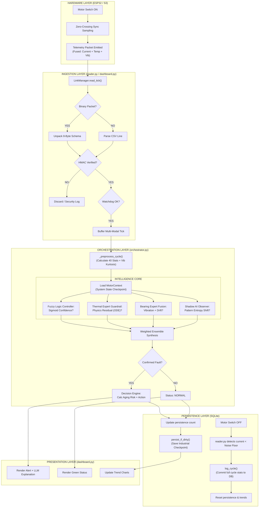

# Velqron Life-Cycle: From Startup to Shutdown

This document provides a technical flowchart of every event and decision point that occurs in the Velqron system during a single motor operating cycle.

## 1. End-to-End Operation Flow

## 2. Key Stage Details

### Stage 1: The "Hardware Integrity Gate"
Before any analysis occurs, the `LinkManager` and `reader.py` verify that the data is trustworthy. If the ESP32 has rebooted or a sensor has failed, the logic engines are immediately bypassed.

### Stage 2: The "Ensemble Verdict"
Instead of relying on a single rule, the system requires a **Voting Majority**.
* **Logic Engine**: Checks hard thresholds.
* **Thermal Expert**: Checks physics (LPTN model).
* **Bearing Expert**: Checks mechanical patterns (Signature drift).
* **Result**: If 2 out of 3 agree, the severity escalates.

### Stage 3: The "Industrial Checkpoint"
On every tick, if the diagnostic state has changed, a minimal JSON blob is saved to the `system_state` table. This ensures that if the power is cut at any point between "Startup" and "Shutdown," the system remembers exactly where it was in the diagnostic process.

### Stage 4: The "Cycle Commit"
Only when the motor current drops below the **Noise Floor (1.5A)** is the entire run considered a "Cycle." At this point, the average current, max temp, and runtime are calculated and written to the `cycles` table for long-term reporting.

---
*Reference: docs/governance/ARCHITECTURE.md*
