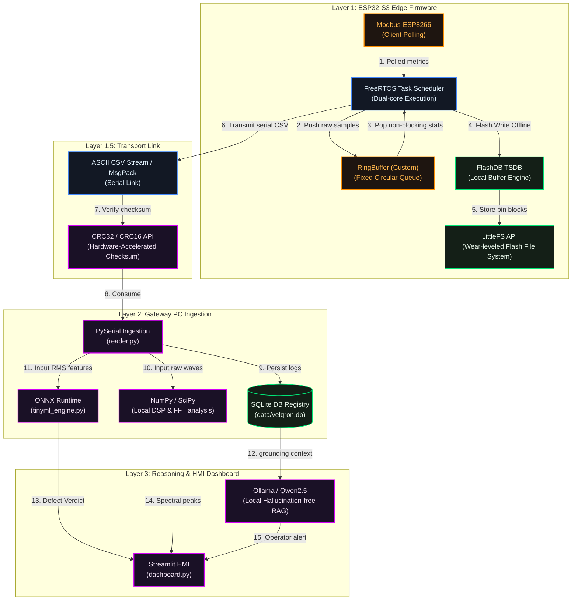

# Velqron Open-Source Stack & Dependencies Reference

This document maps out the open-source software libraries, embedded frameworks, and developer tools integrated across the Velqron Multi-Stage Intelligence pipeline. It outlines their roles, technical benefits, and the impact if they are missing.

---

## Technical Architecture Map

The diagram below visualizes where each open-source tool and built-in API fits into the Velqron data lifecycle:

---

## Detailed Tool Breakdown

### Layer 1: Embedded Edge Node (ESP32-S3)

#### 1. `LittleFS`
* **Category:** Wear-Leveled Flash File System (ESP-IDF Built-in)
* **Technical Benefit:** Provides a structured, wear-leveled filesystem inside the ESP32's raw internal 16MB Flash memory.
* **What if it's missing?** We are forced to write telemetry records directly to raw flash addresses without wear-leveling. The flash memory would wear out in a few months of continuous cyclic writes, causing permanent hardware block damage and device failure.

#### 2. `FreeRTOS`
* **Category:** Real-Time Multitasking OS Scheduler (ESP-IDF Built-in)
* **Technical Benefit:** Enables splitting execution into tasks pinned to separate CPU cores (Core 0: 2000Hz sensor reads; Core 1: 1Hz logging & serial I/O).
* **What if it's missing?** Everything runs on a single-threaded loop. If a temperature sensor read lags or serial command processing blocks for 100ms, the high-frequency vibration sampling rate drops, corrupting the RMS/Kurtosis readings and risking a hardware watchdog trip.

#### 3. `FlashDB`
* **Category:** Time-Series Database Library for Microcontrollers
* **Technical Benefit:** Optimizes time-series telemetry buffering on flash storage. Minimizes flash writes to maximize sector life.
* **What if it's missing?** We fall back to standard LittleFS raw file appending. While functional, standard file operations have higher writing overhead and wear out flash sectors faster during outages.

#### 4. `RingBuffer` (Custom C++ Circular Array)
* **Category:** Static Data Structure
* **Technical Benefit:** Collects high-frequency accelerometer samples in RAM using pre-allocated memory.
* **What if it's missing?** If we dynamically allocate memory using standard vectors/deques, the ESP32 heap fragments over time, leading to silent memory-allocation crashes within days of deployment.

#### 5. `CRC32` & `CRC16`
* **Category:** Hardware Checksum Verification (ESP-IDF Built-in)
* **Technical Benefit:** Utilizes the ESP32's built-in cryptographic hardware to validate data packet parity at high speeds.
* **What if it's missing?** Any EMI noise on the RS485 line or serial cable would corrupt telemetry values undetected, causing the gateway database to record false current surges or temperature spikes.

#### 6. `Modbus-ESP8266`
* **Category:** Modbus RTU Protocol Client Stack
* **Technical Benefit:** Provides standard, robust Modbus RTU register polling for industrial metering (PZEM-016) and PT100 temperature converters.
* **What if it's missing?** We must write custom serial parsers and check routines for each sensor, increasing firmware size and bug risk.

---

### Layer 2 & 3: Gateway PC & Dashboard

#### 7. `SQLite`
* **Category:** In-Process Relational Database Engine
* **Technical Benefit:** Acts as our audit-grade local Evidence Store. Stores asset specifications, cycle details, and engineer feedback.
* **What if it's missing?** We would have to save logs to flat files. Doing drift checks, trend analysis, and RAG index matching would require loading entire files into memory, slowing ingestion.

#### 8. `NumPy` & `SciPy`
* **Category:** Mathematical & DSP Libraries
* **Technical Benefit:** Performs Fast Fourier Transforms (FFT) and Hilbert transformations on raw waveform CSVs to extract sideband frequencies.
* **What if it's missing?** We would have to write complex frequency analysis algorithms manually in Python, which is slow and prone to precision errors.

#### 9. `ONNX Runtime`
* **Category:** Machine Learning Inference Engine
* **Technical Benefit:** Runs the lightweight 389KB Random Forest bearing defect classifier inside the Python gateway.
* **What if it's missing?** The gateway can detect generic vibration anomalies but cannot pinpoint whether the issue is an inner-race, outer-race, or ball fault.

#### 10. `Ollama` & `Qwen2.5:3b`
* **Category:** Local Large Language Model Orchestrator
* **Technical Benefit:** Synthesizes dense telemetry, history, and nameplate specs into plain-language diagnostic descriptions, running 100% offline.
* **What if it's missing?** Operators must manually read numeric CSV tables and trend charts to determine the root cause of an alert.

#### 11. `Streamlit`
* **Category:** Local HMI Web Dashboard
* **Technical Benefit:** Renders real-time telemetry meters, thermal projection timers, alert banners, and feedback input logs.
* **What if it's missing?** We would need to build a custom HTML/CSS/JS frontend and separate API server, doubling the complexity and maintenance overhead.

---
*[← Back to Documentation Index](../INDEX.md)*
