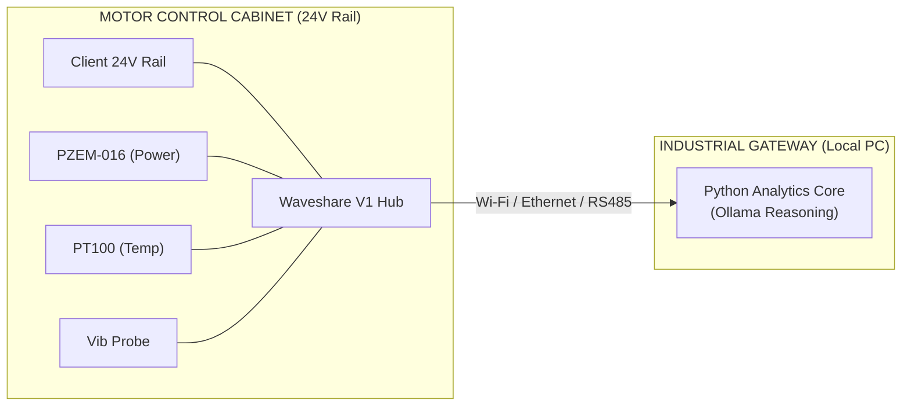

# Velqron V1 Industrial Hub — Technical Specification

> **Project Code:** V1 Pro "Tank"  
> **Status:** Production Design Frozen (Phase 11-12)  
> **Target:** Enterprise Pilot & Industrial Cabinet Deployment

---

## 1. Core Hardware Piece
**Mainboard:** [Waveshare ESP32-S3-RS485-CAN](https://www.waveshare.com/wiki/ESP32-S3-RS485-CAN)
*   **Processor:** ESP32-S3 (AI-Acceleration, dual-core 240MHz).
*   **Memory:** 16MB Flash + 8MB PSRAM (Unlocked high-fidelity sampling).
*   **Isolation:** Full power and digital isolation between the MCU and industrial ports.
*   **Enclosure:** Rail-mounted ABS protective case (Standard DIN rail).
*   **Connectivity:** Isolated RS485 (Primary for Modbus sensors) + Isolated CAN.

---

## 2. Definitive V1 Pro Bill of Materials (BOM)

This BOM is designed for **Zero-Soldering assembly** (Everything uses screw terminals).

| Item | Component | Function | Approx Cost |
| :--- | :--- | :--- | :--- |
| **1** | **Waveshare S3-RS485-CAN** | Central Brain & Enclosure | $20.00 |
| **2** | **Peacefair PZEM-016** | **Main Metering:** Current, Voltage, Power Factor. | $10.00 |
| **3** | **Vibration Sensor (RS485)**| **Mechanical IQ:** Velocity/Peak Acceleration. | $12.00 |
| **4** | **PT100 + RS485 Transmitter**| **Thermal IQ:** High-precision stator temp. | $8.00 |
| **5** | **Storage Cap (4700µF 50V)** | **Buffer:** Brownout-assist for state-save flushing. | $1.00 |
| **TOTAL** | | **Commercial Pilot Node** | **~$51.00** |

---

## 3. Critical Design Decisions: "The Hardened Edge"

To achieve industrial-grade uptime, the following traditional components have been **intentionally removed**:

### A. NO SD Card (Replaced by Solid-State Flash)
*   **Rationale:** SD cards are the #1 failure point due to mechanical vibration and file-system corruption.
*   **Solution:** We use the **16MB Internal Flash** via `LittleFS`. This provides enough space for 50,000+ motor cycle summaries. It is solid-state, part of the chip, and vibration-proof.

### B. Brownout Management [BUFFER]
*   **Rationale:** A 4700µF capacitor is a **buffer, not a promise**. It provides an energy bridge to allow the CPU to detect a voltage drop and initiate an atomic write.
*   **Solution:** Implement a **Falling-Edge Power Fail Sense** on the DC input. When power fails, the ESP32 enters a "Gasp" state: it disables Wi-Fi/BT immediately and flushes only the most critical `MotorContext` delta to Flash.

### C. NO Manual Bias Circuits (Replaced by Modbus Transmitters)
*   **Rationale:** 1.65V bias resistors drift with temperature and add assembly complexity.
*   **Solution:** **PZEM-016 (Modbus)**. All analog-to-digital conversion and RMS math happen inside the pre-calibrated metering module. The ESP32 receives purely digital, drift-free numbers via RS485.

---

## 4. Mechanical & Signal Integrity (Mandatory Standards)

"Zero-soldering" does not mean zero engineering. The following installation standards must be followed to survive a motor cabinet:

1.  **Thermal Coupling:** PT100 probes must be mounted using **thermally conductive epoxy or spring-loaded clips** directly to the motor surface. Tape-based mounting is strictly forbidden.
2.  **Signal Shielding:** All RS485 and Vibration sensor leads must use **Shielded Twisted Pair (STP)** cables. Shields must be grounded at the cabinet entry point.
3.  **Strain Relief:** Every external sensor cable must use an **IP68 Cable Gland** at the enclosure entry to prevent vibration-induced wire fatigue at the screw terminals.

---

## 5. Security Posture (V1 Pilot)

To balance speed and safety, V1 prioritizes **Access Control** over cryptographically heavy write paths:
*   **Signed Config Bundles:** System thresholds and motor profiles are deployed as signed JSON blobs.
*   **Physical Commissioning:** Calibration commands (`R`, `S`) are only accepted during a 10-minute window after physical boot-up.
*   **Access Control:** Serial console interface is locked with a session-based password to prevent casual tampering.

---

## 6. Maintenance & Reliability
*   **Calibration:** Factory-calibrated via the PZEM-016; no user calibration required.
*   **Atomic Persistence:** Uses `LittleFS` with write-leveling to prevent internal Flash wear-out over years of operation.
*   **Validation Requirement:** Every pilot must undergo a **48-hour Thermal Soak** and **EMI Stress Test** before final commissioning.

---

## 7. Deployment Topology

Velqron assumes the **Client** provides a standard industrial cabinet environment.

---
*Reference: docs/governance/DECISIONS.md*
d*
