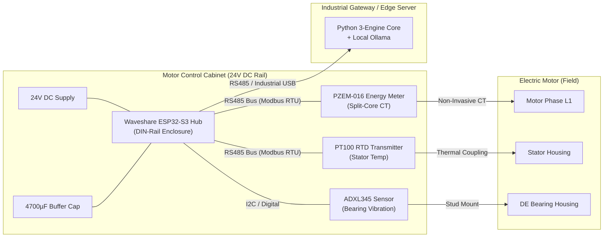
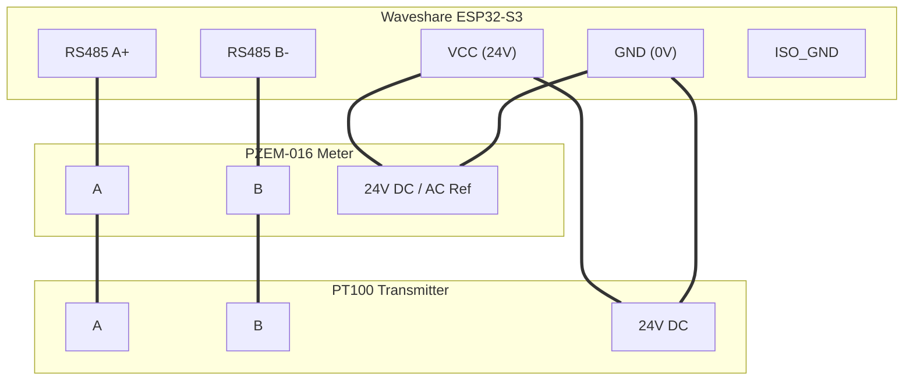

# Velqron V1 Industrial Hardware Guide

This guide documents the production hardware deployment for the **Velqron V1 Pro Industrial Node**. 

The architecture moves away from fragile analog breadboard bias circuits to an **optically isolated, zero-soldering, DIN-rail mounted Modbus RS485 system** designed to survive harsh factory motor cabinets.

---

## 1. System Overview: The Hardened Edge

The Velqron V1 Pro node operates directly inside the motor control center (MCC) or starter cabinet. It draws power from the cabinet's existing 24V DC industrial rail and communicates with pre-calibrated digital sensors over an opto-isolated RS485 bus.



---

## 2. Bill of Materials (BOM) — V1 Pro Production

All components use screw-terminal connections and off-the-shelf industrial parts. **Zero soldering is required.**

| Component | Function | Interface | Operating Spec | Approx Cost |
| :--- | :--- | :--- | :--- | :--- |
| **[Waveshare ESP32-S3-RS485-CAN](https://www.waveshare.com/wiki/ESP32-S3-RS485-CAN)** | Edge controller, flash TSDB, isolation | DIN Rail Mount | 7V–36V DC, 16MB Flash, 8MB PSRAM | ₹1,899 ($23) |
| **Peacefair PZEM-016 + Split CT** | Current, voltage, active power, power factor | RS485 Modbus RTU | 0.05A–100A, 80V–260V AC, 0.5% grade | ₹1,150 ($14) |
| **PT100 Transmitter Module** | Precision stator surface temperature | RS485 Modbus RTU | -50°C to +200°C (±0.3°C accuracy) | ₹1,298 ($16) |
| **ADXL345 Accelerometer** | Bearing mechanical vibration & crest factor | I2C / Digital | ±16g, 3-axis, up to 3200Hz ODR | ₹250 ($3) |
| **4700µF 50V Buffer Capacitor** | Brownout power-fail atomic state-save | Parallel to 24V DC | Energy bridge for atomic flash write | ₹200 ($2.5) |
| **Shielded Twisted Pair (STP) + Glands** | EMI shielding and strain relief | IP68 PG7/PG9 | 24 AWG STP, 120Ω characteristic impedance | ₹300 ($3.5) |
| **Total Node BOM** | **Complete V1 Pro Edge Diagnostic Node** | | | **₹5,097 (~$62)** |

---

## 3. Core Hardware Specifications

### A. Edge Controller: [Waveshare ESP32-S3-RS485-CAN](https://www.waveshare.com/wiki/ESP32-S3-RS485-CAN)
* **Schematics & Pinout:** Refer to the [Waveshare Official Wiki](https://www.waveshare.com/wiki/ESP32-S3-RS485-CAN) for full hardware schematics and jumper configurations.
* **Processor:** Dual-core Xtensa LX7 @ 240MHz with vector instructions (accelerates TinyML and DSP).
* **Isolation:** Onboard power supply isolation and digital ADuM-based signal isolation on RS485 and CAN ports.
* **Storage:** 16MB SPI Flash with wear-leveling (FlashDB). Replaces failure-prone external SD cards.
* **Form Factor:** Injection-molded ABS DIN-rail enclosure (mounts directly to 35mm top-hat rails).
* **Power Input:** Wide-range 7V to 36V DC input (native compatibility with standard 24V factory rails).

### B. Electrical Sensing: Peacefair PZEM-016
* **Why not discrete analog CT bias circuits?** Analog bias networks (e.g. 10kΩ divider circuits) suffer from thermal drift in unconditioned factory cabinets and require continuous ADC offset calibration.
* The PZEM-016 integrates an internal metering DSP that computes True RMS current, voltage, active power, and frequency.
* Digital data is transmitted drift-free over RS485 using standard Modbus RTU registers.
* The split-core current transformer clips over any existing motor phase lead without disconnecting wiring or halting production.

### C. Thermal Sensing: PT100 RTD with Modbus Transmitter
* Class-A 3-wire PT100 probe mounted to the motor stator housing.
* Digital RS485 transmitter converts micro-volt RTD resistance into calibrated temperature registers, eliminating long-distance analog noise.

---

## 4. Electrical Wiring & Bus Architecture

### RS485 Bus Configuration
* **Baud Rate:** 9600 bps
* **Data Bits:** 8
* **Parity:** None
* **Stop Bits:** 1
* **Termination:** 120Ω termination resistor enabled across A/B lines at the physical ends of the bus.

### Pinout Mapping

| Waveshare S3 Terminal | Signal | Connected To |
| :--- | :--- | :--- |
| **VCC (7-36V)** | +24V DC | Cabinet 24V DC Bus (+ 4700µF capacitor positive) |
| **GND** | 0V DC | Cabinet 24V DC Ground (+ 4700µF capacitor negative) |
| **A+** | RS485 Non-Inverting | PZEM-016 Terminal A + PT100 Transmitter Terminal A |
| **B-** | RS485 Inverting | PZEM-016 Terminal B + PT100 Transmitter Terminal B |
| **ISO_GND** | Isolated Ground | Cable shield drain wire (at controller end only) |
| **GPIO 21 (SDA)** | I2C Data | ADXL345 SDA |
| **GPIO 22 (SCL)** | I2C Clock | ADXL345 SCL |



---

## 5. Architectural Reliability Standards: "The Hardened Edge"

To ensure zero-maintenance operation in heavy industrial environments, three architectural design choices are strictly enforced:

### 1. Solid-State FlashDB (NO SD Cards)
* **Problem:** SD cards are the #1 source of embedded field failures under high mechanical vibration and factory thermal cycling.
* **Solution:** Velqron uses 16MB internal SPI flash managed by **FlashDB TSDB**. It supports wear-leveling and retains up to 50,000 cycle diagnostic summaries with zero file-system corruption.

### 2. Atomic Brownout Flush Buffer (4700µF Capacitor)
* **Problem:** Sudden factory power cuts while writing state to flash can corrupt non-volatile tables.
* **Solution:** A 4700µF capacitor on the 24V input rail acts as an energy bridge. When the MCU detects falling input voltage, it immediately initiates an atomic flush of the active `MotorContext` delta and sleeps peripherals before the rail collapses.

### 3. Non-Invasive Mechanical Installation
* **Split-Core CT:** Snaps over insulated phase conductor inside the starter panel. Zero copper cuts.
* **PT100 Mounting:** Fixed to the non-drive-end (NDE) or stator frame using **thermally conductive ceramic adhesive** or heavy-duty spring-loaded magnetic brackets. *Adhesive tape mounting is strictly prohibited.*
* **EMI Shielding:** All sensor runs must use Shielded Twisted Pair (STP) cables. Cable shields must be grounded to the cabinet ground bus at entry.

---

## 6. Testing & Validation

### Standalone Sensor Loopback
To verify the RS485 bus without a live motor:
1. Power the Waveshare S3 via 24V DC (or 5V USB for bench testing).
2. Connect PZEM-016 and PT100 on the RS485 bus.
3. Run the automated hardware validation script:
   ```bash
   python scripts/hardware_validation.py
   ```
4. Confirm Modbus responses for voltage, current, and temperature with zero packet drop.

---

> [!CAUTION]
> Always disconnect and lock out the main 415V/230V breaker before opening motor control cabinets or attaching sensor clamps. Adhere strictly to industrial lockout/tagout (LOTO) protocols.

---

*[← Back to Documentation Index](../INDEX.md)*
