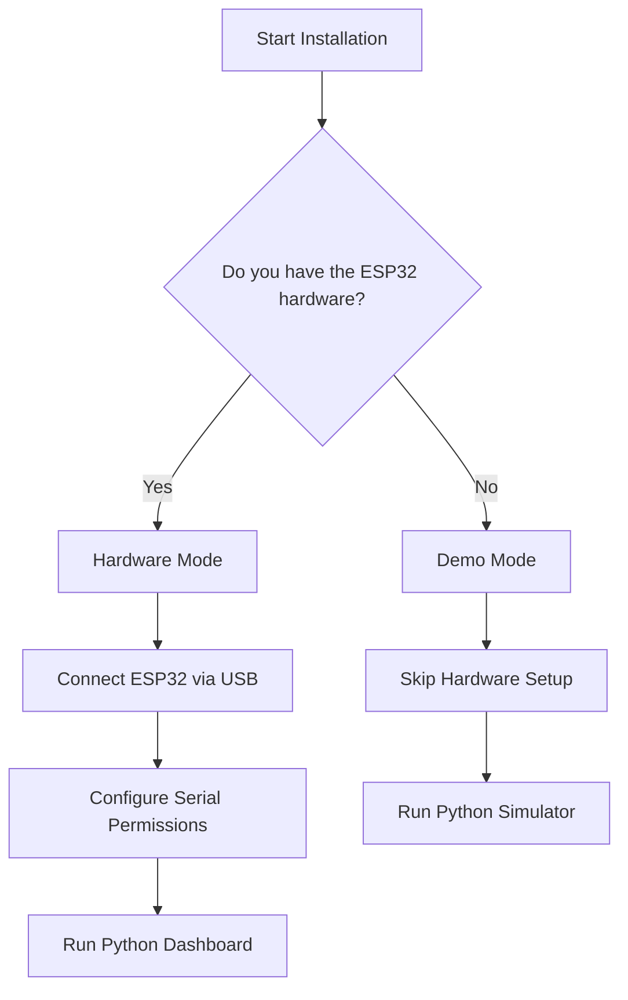

# Velqron Installation & Setup Guide

> **Target Audience:** Systems Engineers, Plant IT, Developers

This guide covers installing Velqron in either **Hardware Mode** (with an ESP32 sensor node) or **Demo Mode** (synthetic data for evaluation).

---

## 1. Prerequisites Checklist

Before beginning, ensure your host machine (Linux/Ubuntu recommended for edge deployment) has the following:

- [ ] **Python 3.10+** (Verify: `python3 --version`)
- [ ] **Node.js 20+** (Verify: `node --version` — required for frontend build)
- [ ] **Ollama** installed (Verify: `ollama --version`)
- [ ] **Git** installed (Verify: `git --version`)

---

## 2. Installation Decision Tree



---

## 3. Core Software Setup

Clone the repository and set up the Python environment:

```bash
git clone https://github.com/rack0911/velqron.git
cd velqron

# Create and activate virtual environment
python3 -m venv venv
source venv/bin/activate

# Install dependencies
pip install --upgrade pip
pip install -r requirements.txt
```

---

## 4. Environment Configuration

Copy the template environment file:

```bash
cp .env.example .env
```

Edit the `.env` file to configure your reasoning engines:

```env
# Optional: Provide an NVIDIA API key for Cloud reasoning mode
NVIDIA_API_KEY="nvapi-your-key-here"

# Optional: Point to a remote Ollama server (defaults to localhost)
OLLAMA_HOST="http://localhost:11434"
```

---

## 5. Local LLM Setup (Ollama)

Velqron's local reasoning engine uses `qwen2.5:3b` by default due to its excellent balance of logical reasoning and edge hardware performance.

1. Ensure Ollama is running:
   ```bash
   ollama serve
   ```
2. Pull the required models:
   ```bash
   ollama pull qwen2.5:3b
   ```

---

## 6. Hardware Setup (Optional)

If you are running in Demo Mode, skip this section.

1. Connect the flashed ESP32 to your host machine via USB.
2. Grant read/write permissions to the serial port (Linux):
   ```bash
   # Add your user to the dialout group (requires logout/login to take effect)
   sudo usermod -aG dialout $USER
   
   # Or grant temporary permissions to the specific port
   sudo chmod a+rw /dev/ttyUSB0 
   ```

> For instructions on flashing the ESP32 firmware and wiring the CT/Temperature sensors, refer to the [Hardware Assembly Guide](HARDWARE_GUIDE.md).

---

## 7. Launching the System

Velqron uses Streamlit for its industrial dashboard. You can launch it using the included watchdog script, which ensures the dashboard restarts automatically if an unhandled exception occurs.

```bash
# Make the watchdog executable
chmod +x run.sh

# Launch the system
./run.sh
```

Alternatively, run Streamlit directly:
```bash
streamlit run dashboard.py
```

Open your browser to `http://localhost:8501`.

---

## 8. Installation Verification

To confirm the installation was successful, run the automated test suite:

```bash
# Run unit and integration tests
pytest

# Run the pipeline stress test (simulates heavy load)
python scripts/stress_test.py
```

---

## 9. Troubleshooting

| Symptom | Cause | Solution |
|---|---|---|
| `SerialException: Permission denied` | User not in `dialout` group | Run `sudo usermod -aG dialout $USER` and log out/in. |
| Dashboard says "Awaiting Serial Data..." infinitely | Wrong port or baud rate | Check ESP32 is plugged in. Velqron auto-detects ports, but ensure no other program (like Arduino IDE) has the port open. |
| Explanations show "ERROR: LOCAL_FAILED" | Ollama is not running | Open a terminal and run `ollama serve`, ensure `qwen2.5:3b` is pulled. |
| `ModuleNotFoundError: No module named 'src'` | PYTHONPATH not set | Launch using `./run.sh` or run `export PYTHONPATH=$PYTHONPATH:.` before starting. |

---

*[← Back to Documentation Index](../INDEX.md)*
